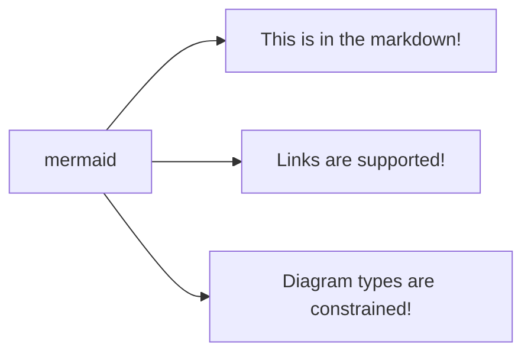
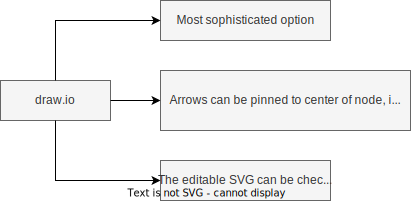

# hubmap-template
Generic language-agnostic repo template with suggestions on best-practices:
As HuBMAP matures we will benefit from using standard software-engineering practices.
Because HuBMAP development is split across multiple repos, from multiple institutions,
with some of the work being done by trainees who might only be around for a short time,
establishing shared practices and structures is particularly critical to maintain a high quality code base over time.

Once you've made a copy of this template, make a feature branch, and work through the TODOs.
If there's something you don't want to handle on the first pass, consider filing an issue for it. 

- [ ] **TODO**: Fill in the README sections below the `
` at the bottom of this page.
- Github settings:
  - [ ] **TODO**: Under "General", turn off github features you don't need, and turn on others that aren't the default. Suggestions:
    - "Wikis" off.
    - "Projects" off.
    - "Allow merge commits" and "Allow rebase merging" off; "Allow squash merging" on.
    - "Automatically delete head branches" on.
  - [ ] **TODO**: Under "Collaborators and teams" add users besides yourself.
  - [ ] **TODO**: Decide on a branch and PR strategy.
    - Feature branches from `main` work for many repos, but if a different strategy (like [gitflow](https://www.atlassian.com/git/tutorials/comparing-workflows/gitflow-workflow)) would work better, explain the strategy in the README, and update the default branch.
    - Add branch protection rules. Suggested rules:
      - "Require a pull request before merging"
      - "Require status checks to pass before merging"
  - [ ] **TODO**: Under "Code security and analysis", turn on:
    - Dependabot
    - Code scanning
- Github issues:
  - [ ] **TODO**: Decide how you want issues reported, and document that decision in the README. Suggest that you create a `triage` label, and use the provided issue template that applies it automatically. Asking that users go through the helpdesk or slack is also reasonable, as is a commitment to keep an eye open for any incoming issues.
  - [ ] **TODO**: Establish responsibility for incoming issues. Suggest that one person saves the url for a filtered list of `triage` issues, reviews the list every day, and removes the `triage` label once they have been reviewed.
  - [ ] **TODO**: Review the issue templates in this repo and edit to fit your needs.
  - [ ] **TODO**: Remove issue labels that do not add much value. Suggest removing `duplicate`, `good first issue`, `help wanted`, `invalid`, `question`.
  - [ ] **TODO**: Add issue labels as needed. Suggest adding `triage`.
- Github CI:
  - [ ] **TODO**: Under `.github/workflows`, update the provided examples as appropriate for your toolchain. Suggest starting with linting and tests. Suggest having each check as a separate workflow, so if there is a failure, its easy to tell at a glance what it was.

# **TODO**: your-repo-name-here

**TODO**: Short description; Also fill in the repo description in Github so there's something beyond just the repo name in the top-level list of repos.

**TODO**: Describe how this relates to the rest of HuBMAP, and in particular how it relates to the Portal. Is this a workflow that prepares data for the portal? Is it an API that will be used by the portal? Is this an ancillary web site the portal should link out to? Please make sure the Portal maintainers are aware of the integration plans.

**TODO**: Diagram: Is there any part of the architecture or process that is easier to understand as a picture? Options:

**TODO**: Think about the audiences for your repo and structure the documentation accordingly, proceeding from outsiders to insiders:
- Users: Where is this deployed? Is there separate API documentation? How should bugs be reported?
- New developers: How do I set up a dev environment? How do I prepare a PR?
- Maintainers: How are releases and deployments managed?